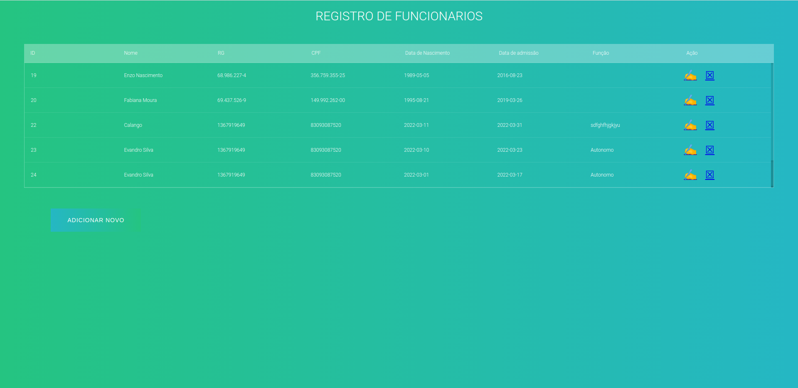
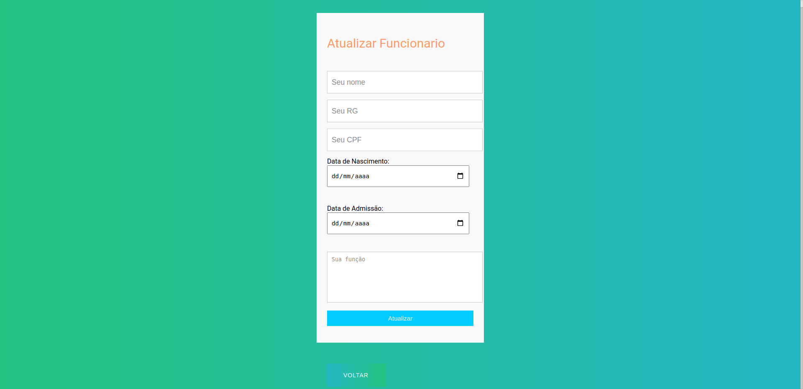
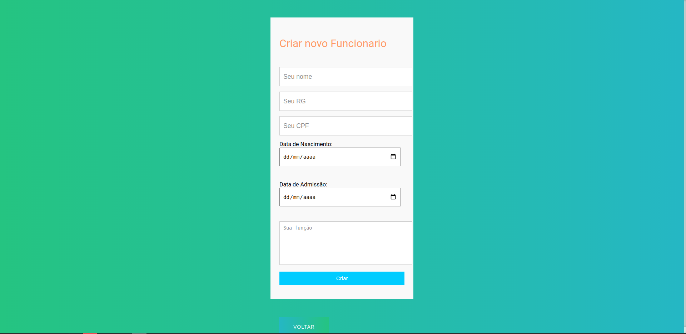
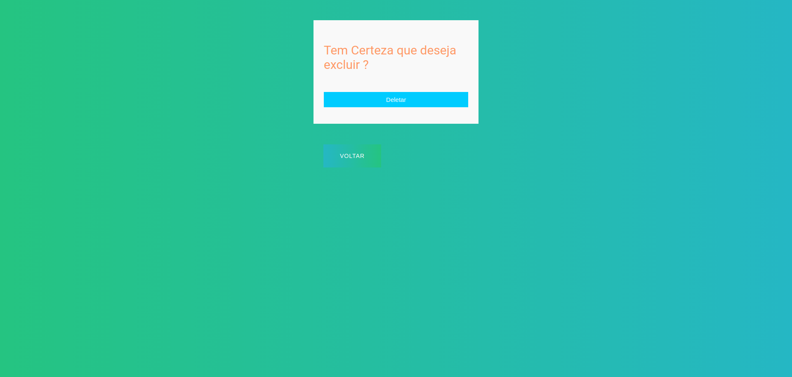

#  Teste Pratico Full Stack - API Rest in python flask

## Description

This project illustrates an api in python use framework Flask and reactJS. We have the backend made in python and the frontend in react, the front is consuming the API and making the POST, GET, PUT, DELETE requests.

## Prototypes of Frontend

